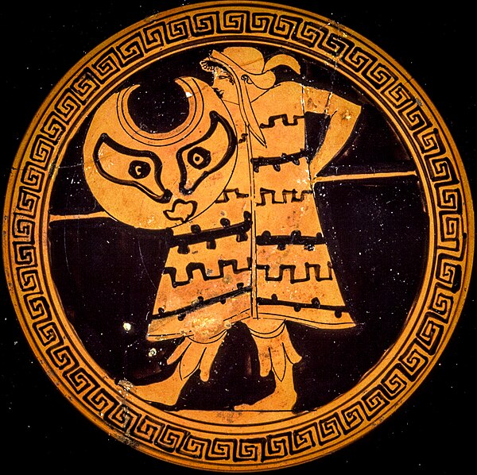

# Peltast Instructions

## Another header

New pages are just new Markdown files.

If it's a single page site, just add content here or in the "index.html" template.

This is an example of text provided in the Markdown file.
